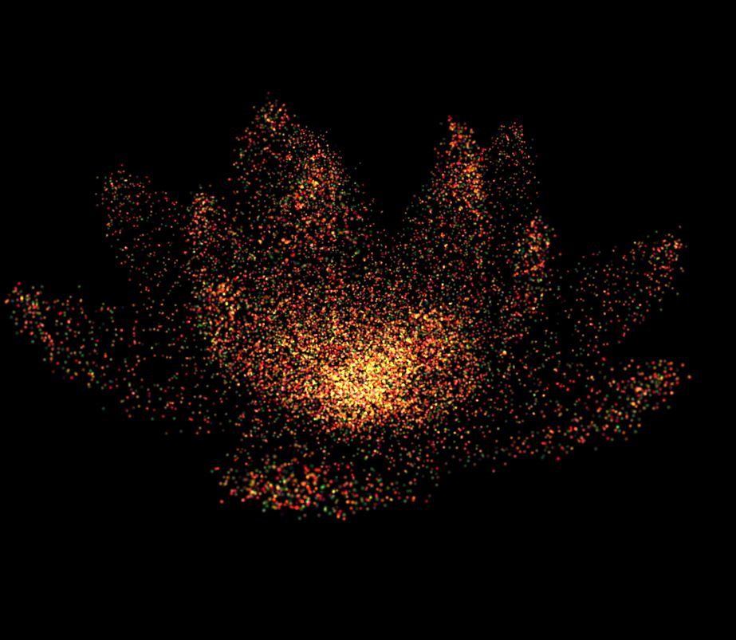
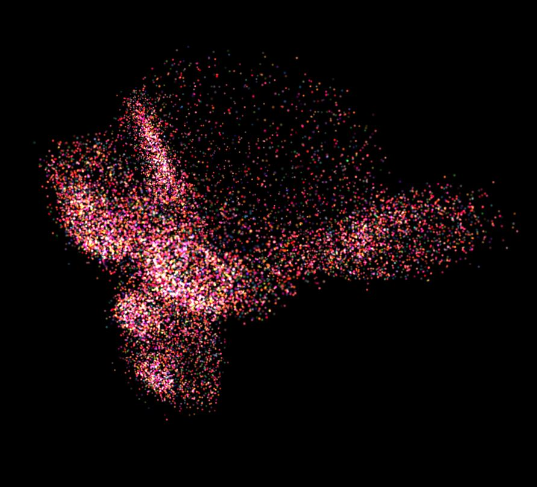
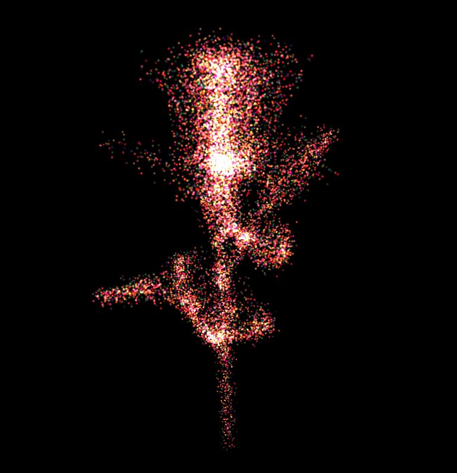
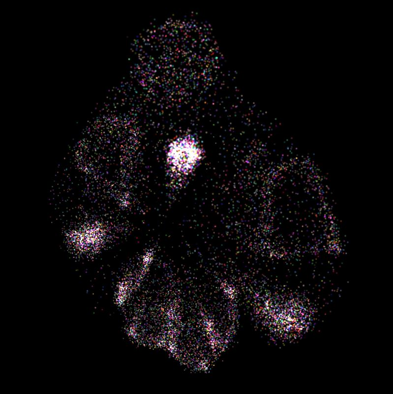
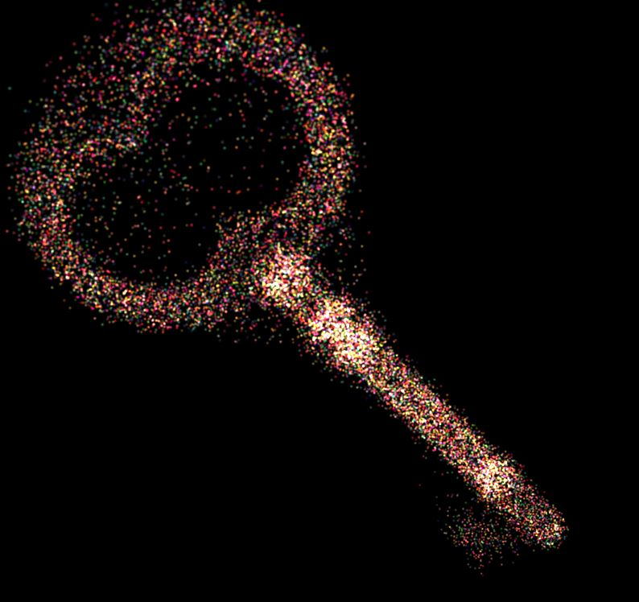
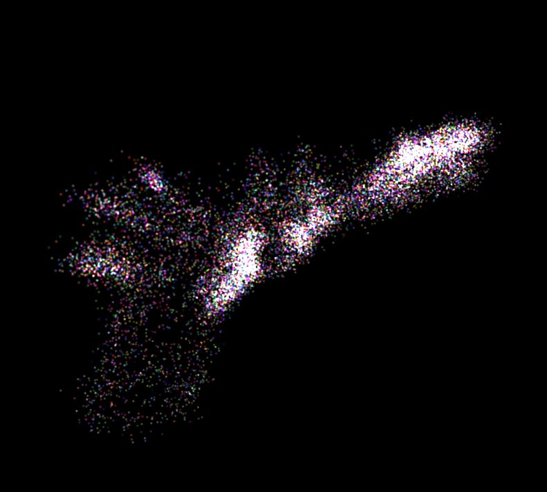

# Project 6: Particle System

* ***University of Pennsylvania, CGGT***
* ***Pennkey: jiaww***
* ***Jiawei Wang***
___

## Overview:
* **Goal:** to make physics-based procedural animation of particles and to practice using OpenGL's instanced rendering system.
* [**Demo Link**](https://jiaww.github.io/homework-6-particle-system-Jiaww/)
* **Final Results**:

|**Final Result (Number of Particles = 25x25x25 )**|
|---|
||

|**Mouse Interactions**|
|---|
||


## Features:
### Particle collection
* I create a class `ParticleSystem` to simulate the movement of the particles. It contains following info:
  ``` typescript
    numParticles: number; // total number of particles
    offsets: Array<number> = []; // current positions of particles
    offsetsDesired: Array<number> = []; // disired positions of particles
    vels: Array<vec3> = []; // current velocities of particles
    accs: Array<vec3> = []; // current accelerations of particles
    masses: Array<number> = []; // masses of particles
    maxVel: number = 20; // maximum velocity the particle can have
  ```
* I use basic *Euler Integration* Method to compute the state of particle system.
* Before each update, compute all the forces and then get the current accelerations. After update, set the accelerations to zeros.

### Procedural coloration and shaping of particles
* **Color**: 
  * The original color of each particle is determined by its position.
  * During the simulation, the color is determined by time value: I set a `tintColor` in fragment shader like following:
  ``` glsl
    vec4 tintColor = vec4(1.0-sin(u_Time), 0.2, sin(u_Time)*cos(u_Time), 1.0);
    tintColor *= 0.5;
    tintColor += vec4(0.5);
    out_Col = vec4(dist) * fs_Col * tintColor;
  ```
  * Besides, the variation of the color is in the same rhythm with the background music.

### Interactive forces
* The user could activate the ***interactive forces*** by uncheck the *camera_enabled* under folder *Mouse Operations*
  * Right click: attract
  * Left click: repell
* Realized by ray-casting from click position and compute the intersection with the bounding box of the mesh to determine the 3d position of the click;
* I also implement the *Force Field* and *Noise Forces* on each particle, user could modify the parameters in GUI

### Mesh surface attraction
* Firstly, just have each vertex on the mesh attract one unique particle in the collection.
* Then, for each particle of the rest collection, assign a random triangle of the mesh, and random barycentric coordinates `u,v,w`, to attach it to the surface of the mesh.
* Finally, it can result like followings:

|**Lotus**|**Suzanne**|**Rose**|
|---|---|---|
||||

|**Baymax**|**Key**|**Pistol**|
|---|---|---|
||||


### Others
* ***Place Attractors and Repellers***: User could set them under folder *Attractor and Repeller*.
* ***Music Synchronization***: The color, mesh changing and rotation are in the same rhythm with the music.

## References:
* DMD and CGGT alumnus Nop Jiarathanakul's [Particle Dream application](http://www.iamnop.com/particles/)

## Music:
* [G-Dragon:무제(無題) (Untitled, 2014)](https://www.youtube.com/watch?v=9kaCAbIXuyg)
